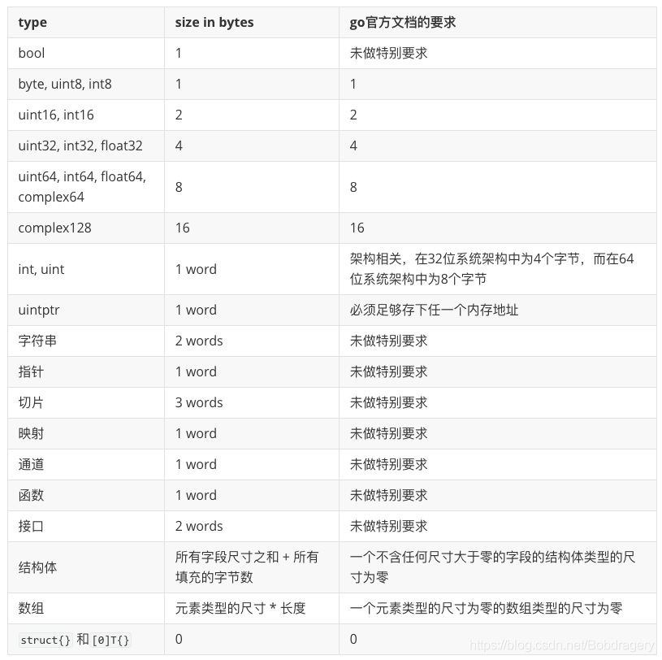
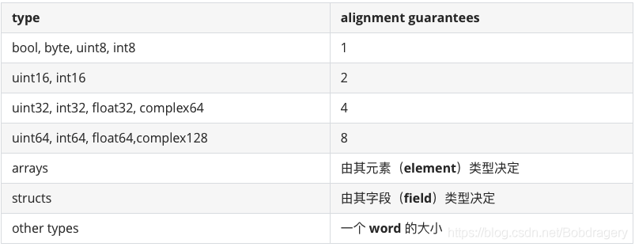

# Golang面试——内存对齐

## Golang对于变量类型的大小保证

在go中，如果两个值的类型为同一种类的类型，并且他们的类型的种类不为接口，数组和结构体,则这连个值的尺寸总是相等的

目前(go1.14)，至少对于官方标准编译器来说，任何一个特定类型的所有值的尺寸都是相等的，所以我们也常说一个值的尺寸为此值的类型的尺寸

下表列出了各种种类的类型的尺寸（对标准编译器1.14来说）:



## Golang对于变量的对齐保证

官方文档中的对齐保证的要求只有如下解释谷歌翻译结果：(原文就是圈红部分的上面的三条)

* 对于任何类型的变量x，unsafe.Alignof(x)的结果最小为1；

* 对于结构类型的变量x：对于x的每个字段f，unsafe.Alignof（x)是所有值unsafe.Alignof（x.f）中的最大值，但至少为1。

* 对于数组类型的变量x：unsafe.Alignof（x）与数组元素类型的变量的对齐方式相同

  

## 内存对齐特征

* 一个结构体类型的尺寸取决于它的各个字段的类型尺寸和这些字段的排列顺序
* 一个数组类型的尺寸取决于它的元素类型的尺寸和它的长度，它的尺寸为它的元素类型的尺寸和它的长度的乘积
* **如果结构或者数组类型包含大小为0的字段或者元素，则其大小为0，两个不同的零大小变量在内存中可能具有相同的地址**

## 例题

```go
type T1 struct {
    a struct{}
    b int64
}

type T2 struct {
    a int64
    b struct{}
}
```

* T1的大小为8字节，因为a不位于末尾，又是零大小字段，因此T1仅有8B
* T2的大小在64位机上为16B，在32位机上为12B，因为T2.b位于结构体末尾，虽然大小为0，但是需要填充，结构体的大小为结构体中最大的元素a的大小的整数倍，因此64位机上填充8B，32位机上填充4B

```go
type T struct {
    a struct{}
    b [0]int
}
```

T的大小为0B，因为仅有零大小字段

```go
type T struct {
    a int8
    b struct{}
    c [0]int
}
```

T的大小为16B，a的大小为1B，b ,c 都为零大小字段，

