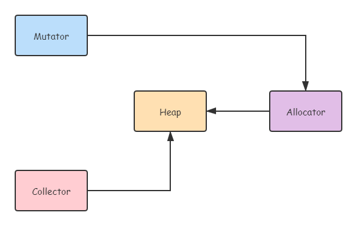
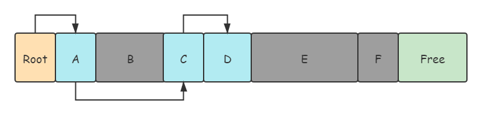
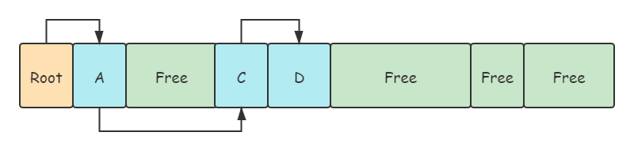
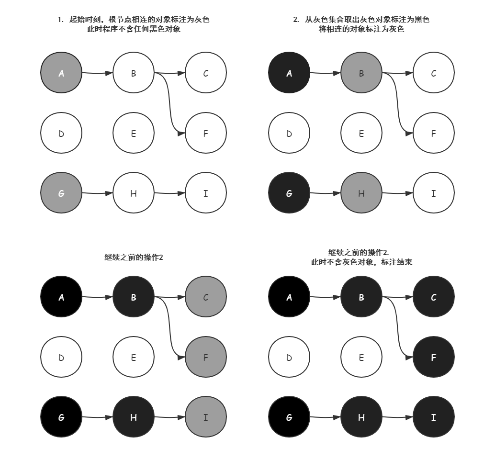
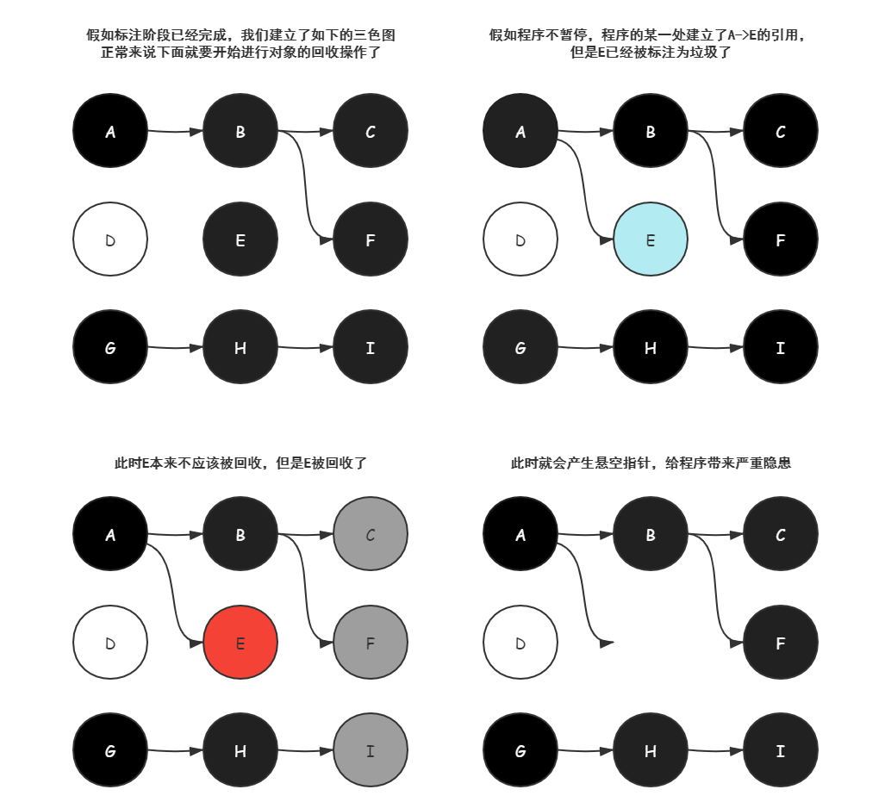
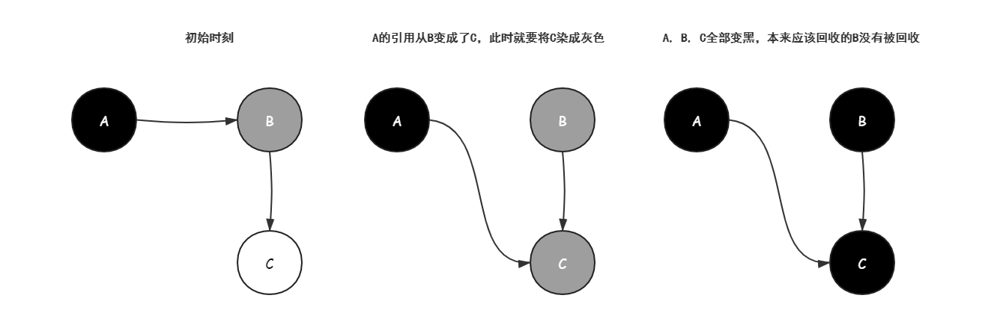
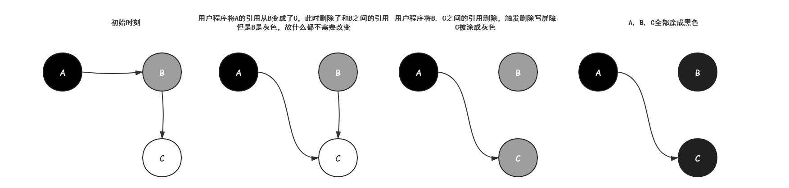
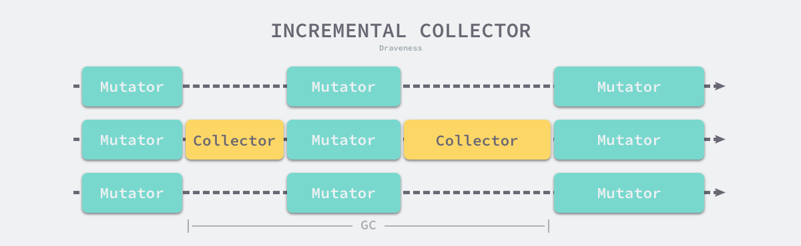
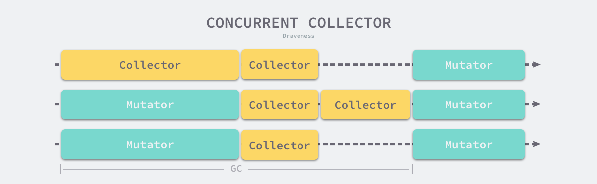

# Go语言垃圾收集器

<!-- vscode-markdown-toc -->
* 1. [早期的Go垃圾收集策略](#Go)
* 2. [Go语言的内存管理组件](#Go-1)
* 3. [GC的原理](#GC)
	* 3.1. [标记清除](#)
		* 3.1.1. [标记阶段](#-1)
		* 3.1.2. [清除阶段](#-1)
	* 3.2. [三色抽象](#-1)
		* 3.2.1. [三色抽象的工作过程](#-1)
		* 3.2.2. [三色抽象不使用STW会产生的问题](#STW)
	* 3.3. [屏障技术](#-1)
		* 3.3.1. [Dijkstra插入写屏障](#Dijkstra)
		* 3.3.2. [Yuasa删除写屏障](#Yuasa)
	* 3.4. [增量和并发](#-1)
		* 3.4.1. [增量GC器](#GC-1)
		* 3.4.2. [并发GC器](#GC-1)

<!-- vscode-markdown-toc-config
	numbering=true
	autoSave=true
	/vscode-markdown-toc-config -->
<!-- /vscode-markdown-toc -->

##  1. <a name='Go'></a>早期的Go垃圾收集策略

早期的Go语言垃圾收集方式是STW(Stop The World)，通过暂停用户程序的方式GC，然而当用户程序越来越多，垃圾越来越多的时候，当系统运行内存达到一定阈值的时候，整个系统就会暂停运行，当GC结束之后，用户程序才可以继续运行。**现在Go语言的GC策略已经复杂了很多** 。

##  2. <a name='Go-1'></a>Go语言的内存管理组件

<div align=center></div>

用户程序Mutator通过内存分配器Allocator在堆上申请内存，而垃圾收集器Collector负责回收Heap上的垃圾。Allocator和Collector共同管理计算机的内存空间。

##  3. <a name='GC'></a>GC的原理

###  3.1. <a name=''></a>标记清除

标记清除([`Mark-Sweep`]())算法是最常见也是最简单的GC算法，标记清除GC器是跟踪式垃圾收集器，其执行过程可以分成**标记([`Mark`]())** 和 **清除([`Sweep`]()**两个过程：

1. 标记阶段——从根对象出发查找并标记堆中的所有存活对象
2. 清除阶段——遍历堆中的全部对象，回收未被标记的垃圾对象并将回收的内存加入**空闲链表**

####  3.1.1. <a name='-1'></a>标记阶段

<div align=center></div>

上面从[`Root`]()节点到A, C, D有可达路径，而B, E, F没有，因此B, E, F会被当成垃圾。

####  3.1.2. <a name='-1'></a>清除阶段

<div align=center></div>

GC从根对象出发，**递归遍历** 这些对象，并将所有可达的对象标注为存活状态，，标注结束之后，GC会依次遍历堆中的垃圾对象并清除这些对象，整个过程需要暂停用户程序的执行，也就会出现STW问题，因此我们需要更加复杂的机制去解决STW问题。

###  3.2. <a name='-1'></a>三色抽象

为了解决原始标记清除算法带来的长时间 STW，多数现代的追踪式垃圾收集器都会实现三色标记算法的变种以缩短 STW 的时间。**三色标记算法将程序中的对象分成白色、黑色和灰色三类** 。

* **白色对象** — 潜在的垃圾，其内存可能会被垃圾收集器回收；
* **黑色对象** — 活跃的对象，包括不存在任何引用外部指针的对象以及从根对象可达的对象；
* **灰色对象** — 活跃的对象，因为存在指向白色对象的外部指针，垃圾收集器会扫描这些对象的子对象；

####  3.2.1. <a name='-1'></a>三色抽象的工作过程

**在垃圾收集器开始工作时，程序中不存在任何的黑色对象，垃圾收集的根对象会被标记成灰色，垃圾收集器只会从灰色对象集合中取出对象开始扫描，当灰色集合中不存在任何对象时，标记阶段就会结束。**

三色标记垃圾收集器的工作原理很简单，我们可以将其归纳成以下几个步骤：

1. 从灰色对象的集合中选择一个灰色对象并将其标记成黑色；
2. 将黑色对象指向的所有对象都标记成灰色，保证该对象和被该对象引用的对象都不会被回收；
3. 重复上述两个步骤直到对象图中不存在灰色对象；

<div align=center></div>

####  3.2.2. <a name='STW'></a>三色抽象不使用STW会产生的问题

因为用户程序可能在标记执行的过程中修改对象的指针，所以三色标记清除算法本身是不可以并发或者增量执行的，它仍然需要 STW，在如下所示的三色标记过程中，**用户程序建立了从 A 对象到 E 对象的引用，但是因为程序中已经不存在灰色对象了，所以 D 对象会被垃圾收集器错误地回收**。

<div align=center></div>

###  3.3. <a name='-1'></a>屏障技术

本来不应该被回收的对象却被回收了，这在内存管理中是非常严重的错误，我们将这种错误称为悬挂指针，即指针没有指向特定类型的合法对象，影响了内存的安全性[5](https://draveness.me/golang/docs/part3-runtime/ch07-memory/golang-garbage-collector/#fn:5)，**想要并发或者增量地标记对象还是需要使用屏障技术**。

内存屏障技术是一种屏障指令，它可以让 CPU 或者编译器在执行内存相关操作时遵循特定的约束，目前多数的现代处理器都会乱序执行指令以最大化性能，但是该技术能够保证内存操作的顺序性，在内存屏障前执行的操作一定会先于内存屏障后执行的操作。

**想要在并发或者增量的标记算法中保证正确性，我们需要达成以下两种三色不变性（Tri-color invariant）中的一种** ：

- **强三色不变性** — 黑色对象不会指向白色对象，只会指向灰色对象或者黑色对象；
- **弱三色不变性** — 黑色对象指向的白色对象必须包含一条从灰色对象经由多个白色对象的可达路径

遵循上述两个不变性中的任意一个，我们都能保证垃圾收集算法的正确性，而**屏障技术就是在并发或者增量标记过程中保证三色不变性的重要技术** 。

####  3.3.1. <a name='Dijkstra'></a>Dijkstra插入写屏障

```markdown
Dijkstra插入写屏障是指每次对象引用发生改变的时候，如果被指向的对象引用为白色，将其变为灰色
```

<div align=center></div>

**可以看到，该插入屏障是一种保守的屏障技术，会将所有可能存活的对象标注为灰色**

####  3.3.2. <a name='Yuasa'></a>Yuasa删除写屏障

```markdown
老对象的引用被删除时，将老对象涂成灰色，老对象引用的下游引用一定可以被灰色对象引用
```

<div align=center></div>

###  3.4. <a name='-1'></a>增量和并发

传统的垃圾收集算法会在垃圾收集的执行期间暂停应用程序，一旦触发垃圾收集，垃圾收集器会抢占 CPU 的使用权占据大量的计算资源以完成标记和清除工作，然而很多追求实时的应用程序无法接受长时间的 STW。

远古时代的计算资源还没有今天这么丰富，今天的计算机往往都是多核的处理器，垃圾收集器一旦开始执行就会浪费大量的计算资源，为了减少应用程序暂停的最长时间和垃圾收集的总暂停时间，我们会使用下面的策略优化现代的垃圾收集器：

- 增量垃圾收集 — 增量地标记和清除垃圾，降低应用程序暂停的最长时间；
- 并发垃圾收集 — 利用多核的计算资源，在用户程序执行时并发标记和清除垃圾；

####  3.4.1. <a name='GC-1'></a>增量GC器

增量式（Incremental）的垃圾收集是减少程序最长暂停时间的一种方案，它可以将原本时间较长的暂停时间切分成多个更小的 GC 时间片，虽然从垃圾收集开始到结束的时间更长了，但是这也减少了应用程序暂停的最大时间：

<div align=center></div>

需要注意的是，**增量式的垃圾收集需要与三色标记法一起使用，为了保证垃圾收集的正确性，我们需要在垃圾收集开始前打开写屏障，这样用户程序修改内存都会先经过写屏障的处理，保证了堆内存中对象关系的强三色不变性或者弱三色不变性**。虽然增量式的垃圾收集能够减少最大的程序暂停时间，但是增量式收集也会增加一次 GC 循环的总时间，在垃圾收集期间，**因为写屏障的影响用户程序也需要承担额外的计算开销** ，所以增量式的垃圾收集也不是只带来好处的，但是总体来说还是利大于弊。

####  3.4.2. <a name='GC-1'></a>并发GC器

并发（Concurrent）的垃圾收集不仅能够减少程序的最长暂停时间，还能减少整个垃圾收集阶段的时间，通过开启读写屏障、**利用多核优势与用户程序并行执行**，并发垃圾收集器确实能够减少垃圾收集对应用程序的影响：

<div align=center></div>

虽然并发收集器能够与用户程序一起运行，但是并不是所有阶段都可以与用户程序一起运行，部分阶段还是需要暂停用户程序的，不过与传统的算法相比，并发的垃圾收集可以将能够并发执行的工作尽量并发执行；当然，因为读写屏障的引入，并发的垃圾收集器也一定会带来额外开销，不仅会增加垃圾收集的总时间，还会影响用户程序，这是我们在设计垃圾收集策略时必须要注意的。
