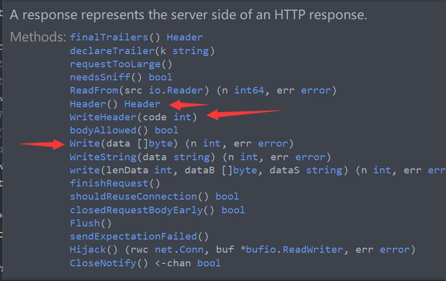

# http包源码解读——ResponseWriter

<!-- vscode-markdown-toc -->
* 1. [前言](#)
* 2. [ResponseWriter定义](#ResponseWriter)
* 3. [#Header设置响应头](#Header)
* 4. [#WriteHeader设置头部状态码和长度字段](#WriteHeader)
* 5. [#Write](#Write)

<!-- vscode-markdown-toc-config
	numbering=true
	autoSave=true
	/vscode-markdown-toc-config -->
<!-- /vscode-markdown-toc -->

##  1. <a name=''></a>前言

在Golang的web开发当中，客户端的请求信息都被封装到了[`Request`]()对象中，但是发送给客户端的响应信息并不是相应的[`Response`]()对象，而是[`ResponseWriter`]()  。[`ResponseWriter`]()是用来创建HTTP响应的接口，在创建HTTP响应的时候会用到[`http.response`]()结构，**注意这个结构体并不是前面介绍的[`Response`]()结构，而是在[`net/http/server.go`]()中定义的一种结构** 。因为[`response`]()结构是一个非导出对象 ，因此只能在[`server.go`]()内部使用。

##  2. <a name='ResponseWriter'></a>ResponseWriter定义

```go
type ResponseWriter interface {
   // 用于设置/获取所有响应头信息
	Header() Header
   // 用于写入数据到响应实体
	Write([]byte) (int, error)
   // 用于设置响应状态码
	WriteHeader(statusCode int)
}
```

可以看到[`ResponseWriter`]()是一个接口的定义，而在底层，是由[`response`]()结构实现，我们先来看看[`response`]()的源码：

```go
type response struct {
	conn             *conn
	req              *Request // request for this response
	reqBody          io.ReadCloser
	cancelCtx        context.CancelFunc // when ServeHTTP exits
	wroteHeader      bool               // reply header has been (logically) written
	wroteContinue    bool               // 100 Continue response was written
	wants10KeepAlive bool               // HTTP/1.0 w/ Connection "keep-alive"
	wantsClose       bool               // HTTP request has Connection "close"
	canWriteContinue atomicBool
	writeContinueMu  sync.Mutex
	w  *bufio.Writer
	cw chunkWriter
	handlerHeader Header
	calledHeader  bool 
	written       int64 
	contentLength int64 
	status        int   
	closeAfterReply bool
	requestBodyLimitHit bool
	trailers []string
	handlerDone atomicBool
	dateBuf   [len(TimeFormat)]byte
	clenBuf   [10]byte
	statusBuf [3]byte
	closeNotifyCh  chan bool
	didCloseNotify int32
}
```

可以看到，[`response`]()中比较多的成员是[`bool`]()类型的，和前面介绍的[`Response`]()还是有很大的不同，实际上，[`response`]()代表的是**服务器端的HTTP响应** 。

为什么说[`response`]()实现了[`ResponseWriter`]()接口？我们利用IDE的快速查看功能，查看[`response`]()实现的方法，如下图：

<div align=center></div>

[`response`]()实现了[`ResponseWriter`]()接口所定义的三个方法，因此它实现了该接口。

##  3. <a name='Header'></a>#Header设置响应头

```go
func (w *response) Header() Header {
	// chunkWriter中的header表示是response.handlerHeader的深拷贝，如果为nil，就要执行深拷贝
    // 满足条件1->response中的wroteHeader表示响应的header是否已经《逻辑上》被写入，只有逻辑写入之后才能物理写入
    // 满足条件2->chunWriter是否已经逻辑性写入
	if w.cw.header == nil && w.wroteHeader && !w.cw.wroteHeader {
		// 为什么需要深拷贝？因为逻辑和物理写入有区别，为了更好的修改数据
		w.cw.header = w.handlerHeader.Clone()
	}
	w.calledHeader = true
	return w.handlerHeader
}
```

##  4. <a name='WriteHeader'></a>#WriteHeader设置头部状态码和长度字段

```go
func (w *response) WriteHeader(code int) {
    // 判断当前connection是否被实现了Hijacked接口的Handler给拦截了
	if w.conn.hijacked() {
        // relevantCaller在调用堆栈中搜索net/http之外的第一个函数。这个函数的目的是提供更有帮助的错误消息
		caller := relevantCaller()
		w.conn.server.logf("http: response.WriteHeader on hijacked connection from %s (%s:%d)", caller.Function, path.Base(caller.File), caller.Line)
		return
	}
    // 如果响应的header已经被逻辑性写入
	if w.wroteHeader {
		caller := relevantCaller()
		w.conn.server.logf("http: superfluous response.WriteHeader call from %s (%s:%d)", caller.Function, path.Base(caller.File), caller.Line)
		return
	}
    // code实际上是状态码，因此要检查状态码的合法性
	checkWriteHeaderCode(code)
    // 检查完毕之后，response的header标注为被逻辑性写入
	w.wroteHeader = true
    // 设置response的响应状态码为code
	w.status = code

	if w.calledHeader && w.cw.header == nil {
		w.cw.header = w.handlerHeader.Clone()
	}

    // 检查Content-Length，如果Content-Length为空，要么标注Content-length，要么从header中删除Contenet-length
	if cl := w.handlerHeader.get("Content-Length"); cl != "" {
		v, err := strconv.ParseInt(cl, 10, 64)
		if err == nil && v >= 0 {
			w.contentLength = v
		} else {
			w.conn.server.logf("http: invalid Content-Length of %q", cl)
			w.handlerHeader.Del("Content-Length")
		}
	}
}
```

##  5. <a name='Write'></a>#Write

实际上[`response`]()的写并不是由一个单独的Writer来完成的，golang根据不同的情况，将多种Writer串成了一个链表，该链表按照如下的方式组合：

1. [`ResponseWriter`]() ：由[`response`]()本身提供写操作 
2. [`bufio.Writer`]() ：由[`response.w`]()提供，即[`bufio.Writer`]()完成写操作
3. [`chunkWriter.Writer`]()  ：提供了对于[`Content-Type/Length`]()的一些写操作
4. [`bufio.Writer`]() ：由[`conn.bufw`]()提供，提供了默认4KB写入缓冲
5. [`checkConnErrorWriter`]() ：处理非空错误
6. [`net.Conn`]()提供的Writer

下面是Writer链表对于写操作的传递操作：

* 若初始的header中包含[`Content-Length/Type`]() ，则[`ResponseWriter`]()会被短路
* 当header已经被发送并且不是[`chunk mode`]()，即分块模式的时候，并且Writer(2)没有缓冲的数据，写操作直接交给Writer(4)
* 在分块模式下，Writer(1)至Writer(2)都应该被短路，直接交给Wirter(3)

分析了上面的大致写操作，我们来看源码：

```go
func (w *response) Write(data []byte) (n int, err error) {
	return w.write(len(data), data, "")
}
```

```go
func (w *response) write(lenData int, dataB []byte, dataS string) (n int, err error) {
    // 如果当前connection已经被拦截
	if w.conn.hijacked() {
        // 要发送的data长度大于0
		if lenData > 0 {
            // 返回错误
			caller := relevantCaller()
			w.conn.server.logf("http: response.Write on hijacked connection from %s (%s:%d)", caller.Function, path.Base(caller.File), caller.Line)
		}
		return 0, ErrHijacked
	}

	if w.canWriteContinue.isSet() {
		w.writeContinueMu.Lock()
		w.canWriteContinue.setFalse()
		w.writeContinueMu.Unlock()
	}

    // 如果header没有被逻辑性的写入response.wirter
	if !w.wroteHeader {
        // 内部调用ResponseWriter的writeHeader来设置HTTP状态码和Conntent-Length等字段
		w.WriteHeader(StatusOK)
	}
	if lenData == 0 {
		return 0, nil
	}
	if !w.bodyAllowed() {
		return 0, ErrBodyNotAllowed
	}

	w.written += int64(lenData) // ignoring errors, for errorKludge
	if w.contentLength != -1 && w.written > w.contentLength {
		return 0, ErrContentLength
	}
    // 这里有些看不太懂
	if dataB != nil {
		return w.w.Write(dataB)
	} else {
		return w.w.WriteString(dataS)
	}
}
```


