# http包源码解读之Server

<!-- vscode-markdown-toc -->
* 1. [环境准备](#)
* 2. [http.HandleFunc](#http.HandleFunc)
* 3. [Server.ListenAndServe](#Server.ListenAndServe)
* 4. [ResponseWriter.Write](#ResponseWriter.Write)

<!-- vscode-markdown-toc-config
	numbering=true
	autoSave=true
	/vscode-markdown-toc-config -->
<!-- /vscode-markdown-toc -->

##  1. 环境准备

我们先从一个很简单的`http`包的使用说起。如果我们想要创建一个Server，设置地址，端口号，路径处理器，最后启动这个Server，大概的代码流程如下：

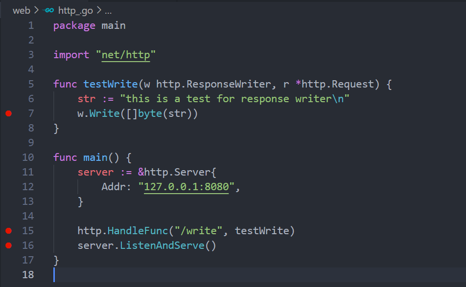

我们在三个位置打了断点，分别检测下面三个方法的执行流程：

* [`http.HandleFunc`]() 
* [`server.ListenAndServe`]()
* [`response.Write`]()

调试环境准备完成之后，开启调试。

##  2. http.HandleFunc

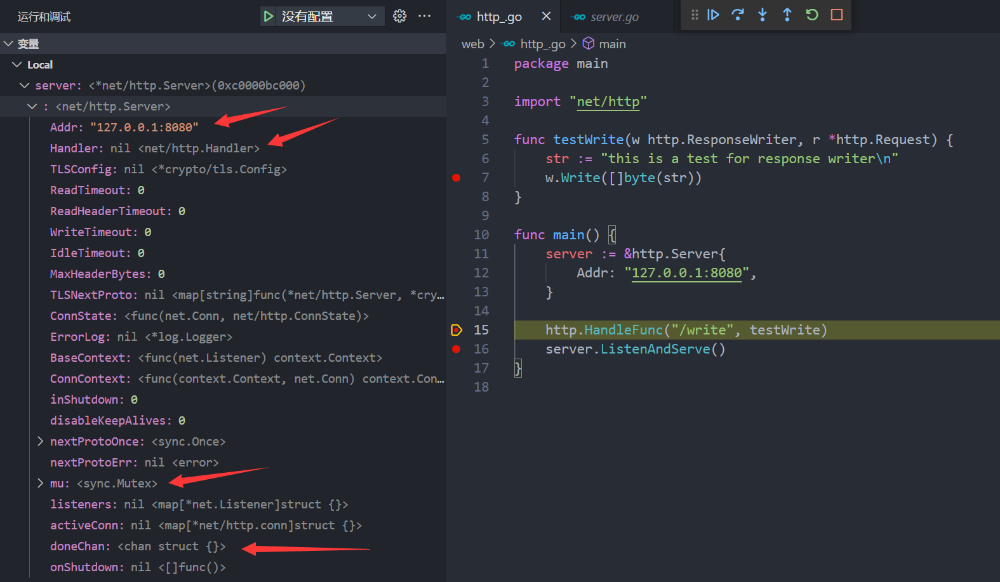

起初，我们将[`http.Server.Addr`]()字段设置为[`127.0.0.1:8080`]() ，其余的均保持默认值。继续单步追踪：

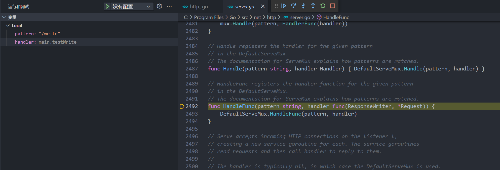

由于没有设置[`mux`]()复用器，而是直接调用[`http.HandleFunc`]()而不是[`userMux.HandlerFunc`]()，程序默认使用了[`http`]()包提供的[`DefaultServerMux`]()作为该服务器的复用器。将程序中定义的路径pattern作为参数继续调用[`DefaultServerMux.HandleFunc`]() 。继续单步调试：

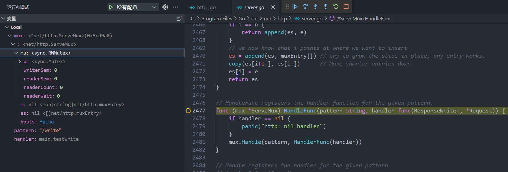

在[`DefaultServerMux.HandleFunc`]()中，程序将用户定义的自定义handler-[`testWrite`]()调用封装函数[`HandlerFunc()`]() ，继续交给[`DefaultServerMux.Handle`]()处理。继续单步追踪：

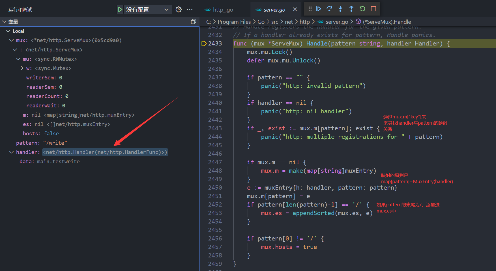

在[`Handle`]()函数中，首先先通过[`patttern`]()和[`handler`]()添加映射关系，存储在[`mux.m`]()，一个map中，map的key为[`pattern`]()路径字符串，map的value为[`MuxEntry`]()复用器单元。该函数执行完成之后，**路径和处理器的映射关系就添加进复用器mux里面了** 。

##  3. Server.ListenAndServe

路径字符串和路径处理器的关系映射完毕之后，下面就是启动[`Server`]()的流程了，[`Server`]()的启动会调用[`ListenAndServe`]()方法，单步追踪代码：

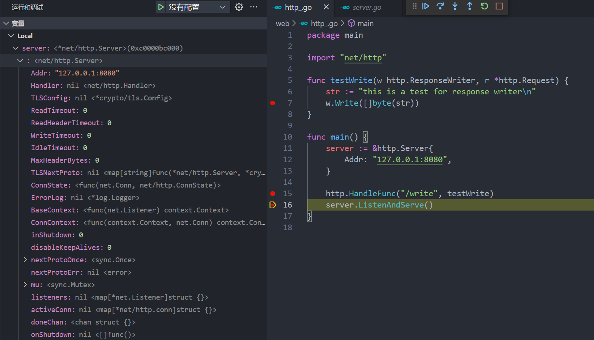

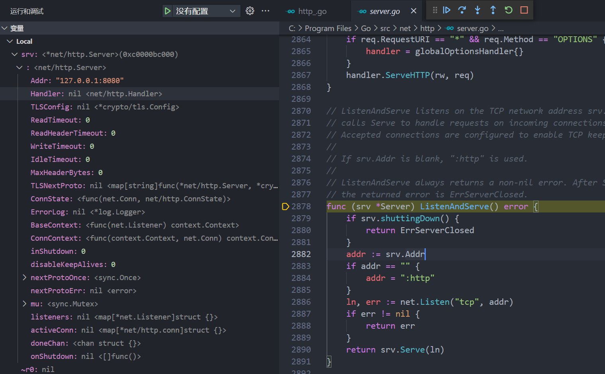

可以看到内部调用[`Server.Serve`]()函数，其中[`ln`]()是我们创建服务器对应的监听器。继续单步追踪

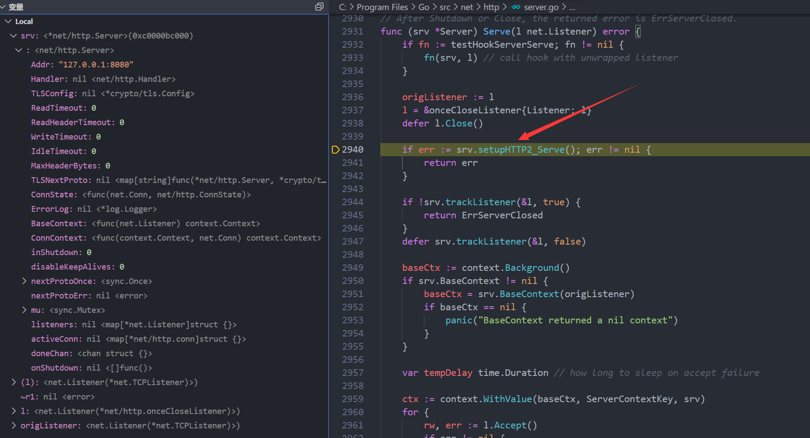

在[`Server.Serve`]()内部，首先完成一些有关监听器的处理操作，比如设置监听器的钩子函数，接着在箭头所指的方向调用[`srv.setupHTTP2_Serve`]()来设置HTTP的一些初始配置:

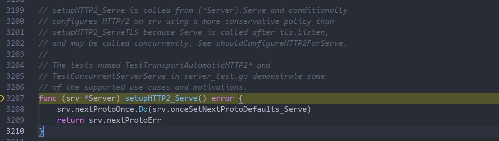

其中[`srv.nextProtoOnce.Do(srv.onceSetNextProtoDefaults_Serve)`]()使用了[`Once`]()确保仅仅调用一次

完成了HTTP初始配置之后，需要设置当前连接的上下文[`Context`]()，上下文能够对处于上下文中的Goroutine进行统一管理，比如及时取消Goroutine防止不必要的资源浪费，在设置上下文的同时还需要将监听器设置到上下文当中：

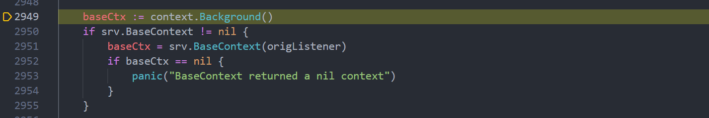

设置完上下文之后，将当前连接的上下文作为[`Backgrround`]()上下文的子上下文，其中key设置为[`ServerContextKey`]() 。

截至目前为止，所有的连接准备工作处理完毕，下面就是开启服务器：

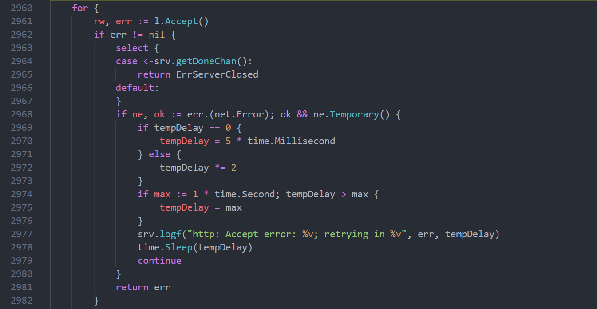

程序利用了一个死循环[`for{}`]()来持续监听到达的请求，一旦触发[`Accept`]()，将处理到达的请求，如果请求中出现错误，并且是网络的错误，程序会默认执行重试操作，每一次重试时间间隔都会设置为上一次重试的2倍(有上限)，而[srv.getDoneChan]()则会监听上下文取消的事件，一旦连接取消(或者上下文取消，则会终止一切操作)。

**到这里为止有一个问题，那就是[`Accept`]()是同步的还是阻塞的？** ，为了寻找这个答案，我们继续往下寻找：

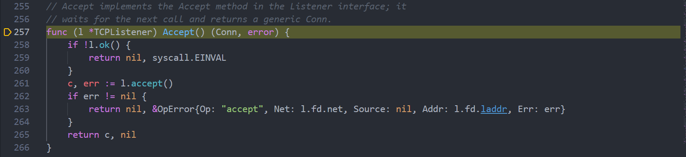

内部调用了[`TCPListener.accept`]() ：

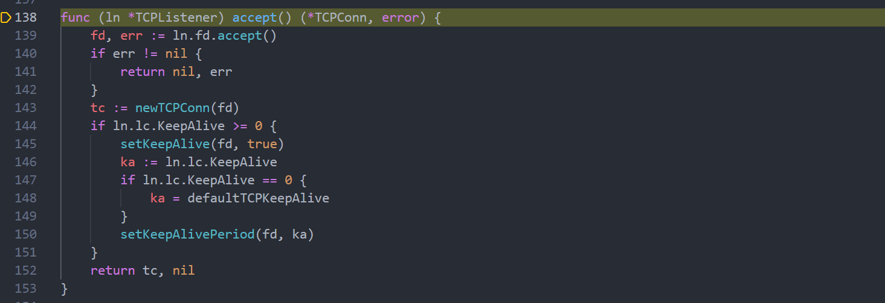

经过多层递归我们找到了下面的代码：

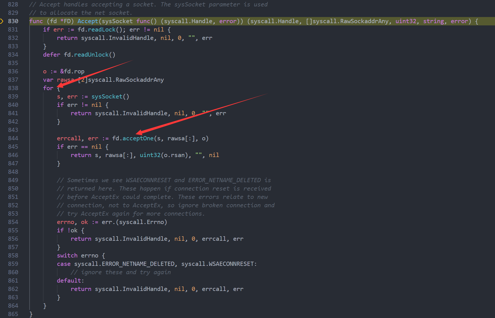

可以看到里面一直在执行一个循环，也就是说[`Accept`]()方法本身是阻塞的。

**到目前为止，我们完整分析了Server的启动过程** 。

##  4. ResponseWriter.Write

在代码中我们定义了一个[`Handler`]() ，通过将其注册到复用器mux中，来拦截并处理我们对某个地址的请求，如果我们想对服务器写一个字符串来输出到网页中，需要调用[`response.Write`]()方法，下面我们单步调试看看[`Write`]()到底是如何工作的。

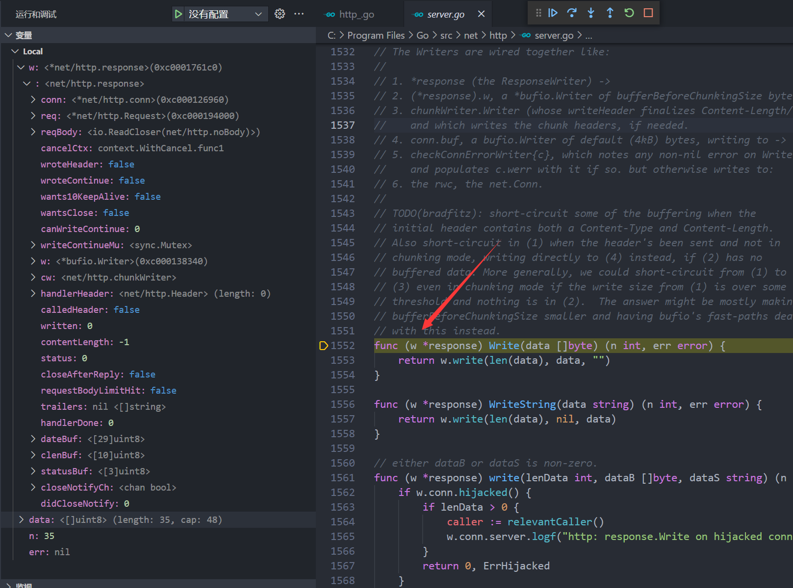

内部调用了[`write`]()这个未导出的方法：

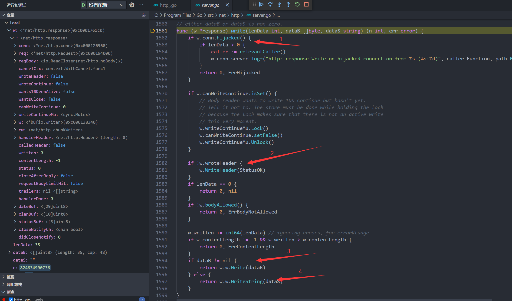

执行完成之后，程序退出。

